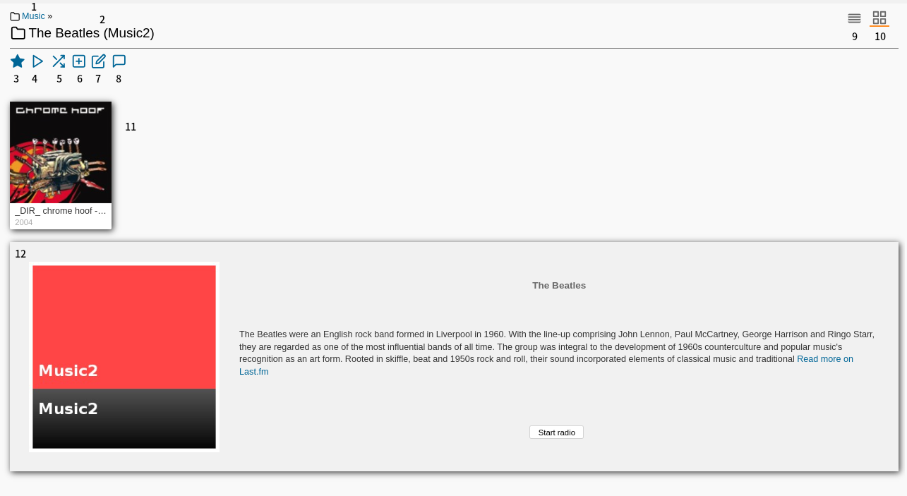
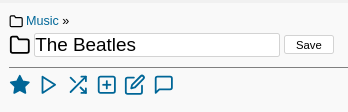
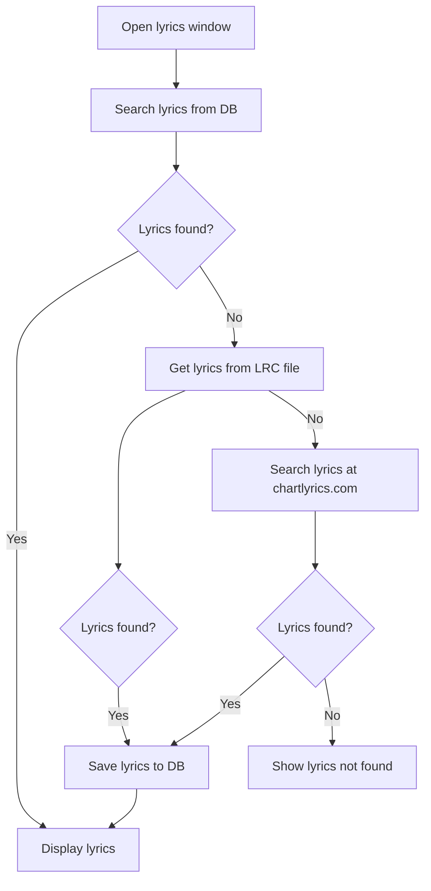
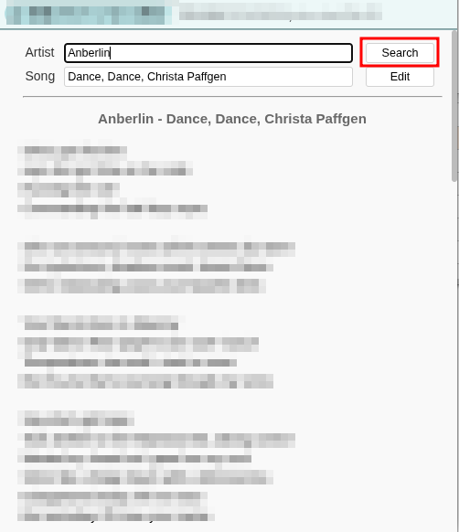
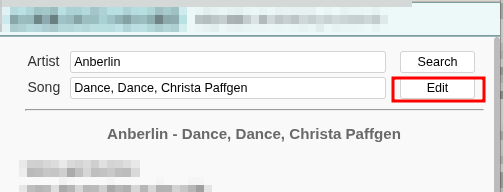
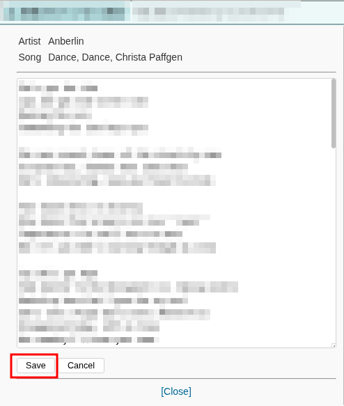
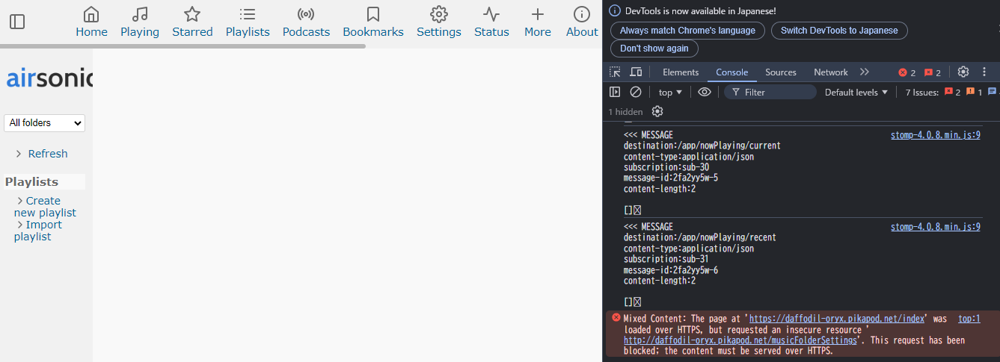

<!--
# docs/ADVANCED.md
# thewriteway/airsonic-advanced
-->
Airsonic-Advanced — Advanced Topics
===================================

This is the full manual for Airsonic-Advanced — everything past "the server is running and can see my music". The [README](../README.md) gets you that far: downloads, Docker, the admin account, adding media folders. From here on, this single page is the documentation.

It is deliberately one file rather than a folder of small ones, so that `Ctrl+F` finds anything in the manual in one go and links to it never go stale. Use the table of contents below, or GitHub's outline button at the top of the page, to jump around.

**What's in here**

| If you want to… | Read |
| --- | --- |
| Set the server up properly the first time — process user, accounts, media folders | [First start](#first-start) |
| Understand why your library looks the way it does, or why cover art is missing | [How media is organized](#how-media-is-organized) |
| Learn what the buttons in the artist, podcast and lyrics screens do | [Web UI](#web-ui) |
| Change a setting, or find out which of the four configuration mechanisms owns it | [Configuration](#configuration) |
| Put the server on the internet safely, behind TLS | [Reverse proxy](#reverse-proxy) |
| Play audio out of the server's own sound card | [Jukebox](#jukebox) |
| Connect a phone app, Sonos or Chromecast — and fix the login failure that catches most people | [Clients and third-party apps](#clients-and-third-party-apps) |
| Fix something that is visibly broken | [Troubleshooting](#troubleshooting) |

The sections build on each other loosely — reverse proxy setup, third-party clients and the HTTPS troubleshooting entry are really one story told from three angles — so cross-references point at the section that owns each topic rather than repeating it.

For general Airsonic usage that Airsonic-Advanced inherits unchanged, the [upstream Airsonic documentation](https://airsonic.github.io/docs/) still applies. Where the two disagree, this document is authoritative.

Contents
--------

- [First start](#first-start)
  - [Run Airsonic as a dedicated user](#run-airsonic-as-a-dedicated-user)
  - [User accounts](#user-accounts)
  - [Media folders](#media-folders)
- [How media is organized](#how-media-is-organized)
  - [Categorization rules](#categorization-rules)
  - [Cover art and artist images](#cover-art-and-artist-images)
- [Web UI](#web-ui)
  - [Artist view](#artist-view)
  - [Editing an artist name](#editing-an-artist-name)
  - [Podcast channels](#podcast-channels)
  - [Lyrics](#lyrics)
- [Configuration](#configuration)
  - [Where settings live](#where-settings-live)
  - [Configuration reference](#configuration-reference)
  - [Compatibility notes](#compatibility-notes)
- [Reverse proxy](#reverse-proxy)
  - [Prerequisites](#prerequisites)
  - [Forward headers](#forward-headers)
  - [How Airsonic uses forwarded headers](#how-airsonic-uses-forwarded-headers)
  - [Apache](#apache)
  - [Other proxies](#other-proxies)
- [Jukebox](#jukebox)
  - [Finding the device name](#finding-the-device-name)
  - [Using sound.properties](#using-soundproperties)
  - [Using Java parameters](#using-java-parameters)
  - [Using systemd](#using-systemd)
  - [Using Docker](#using-docker)
  - [Jukebox with PulseAudio](#jukebox-with-pulseaudio)
- [Clients and third-party apps](#clients-and-third-party-apps)
  - [Token authentication](#token-authentication)
    - [Option 1: use password authentication](#option-1-use-password-authentication)
    - [Option 2: give the account a decodable credential](#option-2-give-the-account-a-decodable-credential)
    - [What you are trading away](#what-you-are-trading-away)
- [Troubleshooting](#troubleshooting)
  - [Cue sheet tracks do not end at the end of the track](#cue-sheet-tracks-do-not-end-at-the-end-of-the-track)
  - [Web UI does not work over HTTPS](#web-ui-does-not-work-over-https)
  - [A third-party app cannot log in](#a-third-party-app-cannot-log-in)

---

First start
-----------

### Run Airsonic as a dedicated user

Do not run Airsonic as `root`. Create a dedicated user account for the server process and run it as that user.

> **Note:** after changing the process user, re-check the permissions on your Airsonic home directory and media folders — the new user needs read access to your media and read/write access to the Airsonic data directory.

### User accounts

Airsonic creates an administrator account named `admin` on first startup. The password is **not** fixed:

- Set the `AIRSONIC_ADMIN_PASSWORD` environment variable before the first start to choose it yourself.
- Otherwise a strong random password is generated and written to the startup log (`docker logs` for container installs).

Change it afterwards under `Settings` > `Users`, where you can also create additional accounts and choose which operations each is allowed to perform.

If you intend to use a third-party Subsonic app, read [Clients and third-party apps](#clients-and-third-party-apps) before creating the account — the choice of password storage format decides whether token authentication will work.

### Media folders

You must tell Airsonic where your music and videos are. Select `Settings` > `Media folders` to add them. (If you do not see this option, log in with an account that has administrative privileges.)

Airsonic organizes media by **how it is laid out on disk**, not by the tags embedded in the files — although tags are read for presentation and search. An `artist/album/song` layout is therefore strongly recommended; tools such as MediaMonkey can help you get there. See [Categorization rules](#categorization-rules) for exactly how directories are interpreted.

---

How media is organized
----------------------

### Categorization rules

Airsonic-Advanced classifies directories and files into Artist, Album, Song and Video with the following logic:

| Type | Description |
| --- | --- |
| Song | A single audio file, if it has one of the extensions defined in `Settings` > `General` > `Music files`. |
| Video | A single video file, if it has one of the extensions defined in `Settings` > `General` > `Video files`. |
| Album | A parent directory containing at least one Song or Video. |
| Artist | A parent directory containing albums. If it contains songs or videos directly, it is treated as an album instead. |

Applied to a tree, this means:

```
.
├── Artist1
│   ├── Album1
│   │   ├── Song1.flac
│   │   ├── Song2.mp3
│   │   └── Folder.jpg
│   ├── Artist2
│   │   ├── Album2
│   │   │   ├── Song3.ogg
│   │   │   ├── Song4.ogg
│   │   │   └── Folder.jpg
│   │   └──Album3
│   │       ├── Song5.mp3
│   │       ├── Song6.mp3
│   │       └── Folder.jpeg
├── Album2
│   ├── Song7.mp3
│   ├── Video1.mp4
│   └── Folder.jpg
```

### Cover art and artist images

Cover art settings live in `Settings` > `General`:

| Item | Description | Default |
| --- | --- | --- |
| Cover art files | Image file names and extensions to use as cover art, separated by spaces. | `cover.jpg cover.png cover.gif folder.jpg jpg jpeg gif png` |
| Cover art source | Where cover art is taken from. | Prefer external file over embedded image |
| Cover art quality | JPEG quality of generated thumbnails. | 90 |
| Cover art concurrency | How many cover art thumbnails may be generated simultaneously. Higher means faster bulk generation but more CPU threads. Requires a restart. | 4 |

Cover art handling assumes the artist/album/song folder structure described above.

**For music files**, art is resolved in this order:

1. According to `Cover art source`:
   - *Prefer embedded image over external file* — the image embedded in the file wins.
   - *Prefer external file over embedded image* — an image in the same directory wins.
   - *Use only embedded image* — only the embedded image is considered.
   - *Use only external file* — only images in the same directory are considered.
2. If nothing is found, the default cover art is used.

**For albums**, the cover art of one of the music files directly under the album directory is used.

**For artists**, an image matching `Cover art files` in the artist directory is used; if there is none, a default artist image is generated. Note that setting `Cover art source` to *Use only embedded image* stops artist images from being picked up out of the artist directory.

---

Web UI
------

### Artist view



| Number | Description | Role |
| --- | --- | --- |
| 1 | Parent directory links. Click a name to navigate to a parent directory. | User |
| 2 | Artist name. If you edit it, the original name is displayed in `( )`. | User |
| 3 | Star — add the artist to your favorites. | User |
| 4 | Play — play all songs by the artist. | User |
| 5 | Shuffle — shuffle all songs by the artist. | User |
| 6 | Add to player — add all songs by the artist to a player. | User |
| 7 | Edit artist — edit the artist name. | CoverArt |
| 8 | Comment — add a comment to the artist. | Comment |
| 9 | List view. | User |
| 10 | Grid view. | User |
| 11 | Albums by the artist. | User |
| 12 | Artist information from Last.fm. | User |

The *Role* column is the user role required to see the control.

### Editing an artist name



1. Click the edit artist button.
2. Edit the artist name.
3. Click save.

Click the edit artist button again to cancel. To update search results afterwards a library rescan is required, but a full scan is not.

### Podcast channels


| Number | Description | Role |
| --- | --- | --- |
| 1 | Play the podcast channel. | User |
| 2 | Delete the podcast channel. | Podcast |
| 3 | Retrieve the new episode list. | Podcast |
| 4 | Configure the podcast channel rule. | Admin |
| 5 | Refresh page. | User |
| 6 | Download selected episodes. Visible once at least one checkbox is checked. | Podcast |
| 7 | Delete selected episodes. Visible once at least one checkbox is checked. | Podcast |
| 8 | Lock selected episodes. Locked episodes cannot be deleted and are not counted by the "Keep X latest episodes" rule. Visible once at least one checkbox is checked. | Podcast |
| 9 | Unlock selected episodes. Visible once at least one checkbox is checked. | Podcast |
| 10 | Lock/unlock an individual episode. | Podcast |
| 11 | Reset an episode's status to "New" for re-downloading. If the episode is marked "Deleted" it will be locked to prevent deletion. | Podcast |
| 12 | Download an individual episode. | Podcast |

### Lyrics

Airsonic-Advanced supports three lyrics sources: `chartlyrics.com` (legacy support), LRC files, and manual user input.

When you open the lyrics window, this search runs:



#### chartlyrics.com

Lyrics can be searched on `chartlyrics.com` by song title and artist name. This is mainly legacy support — the site does not always have current lyrics.

The lyrics window offers text fields for artist name and song title. After clicking search, found lyrics are displayed and saved to the database automatically.



#### LRC files

Place the LRC file in the same directory as the music file, with a filename that matches exactly except for the extension — `song.mp3` pairs with `song.lrc` or `song.LRC`.

Supported:

```
music/
├── artist/
│   ├── album/
│   │   ├── track.mp3
│   │   ├── track.lrc        ← Supported: filename matches, extension is .lrc
│   │   ├── track2.mp3
│   │   └── track2.LRC       ← Supported: filename matches, extension is .LRC
```

Not supported:

```
music/
├── artist/
│   ├── NotWorking/
│   │   ├── song.mp3
│   │   ├── song.Lrc         ← Not supported: mixed case extension
│   │   ├── song2.mp3
│   │   └── othername.lrc    ← Not supported: filename does not match
```

- The LRC file must be in the same folder as the music file.
- The filename must match exactly, except for the extension.
- Only `.lrc` (lowercase) and `.LRC` (uppercase) are recognized; mixed case such as `.Lrc` is not.

Supported LRC formats:

| Format | Supported |
| --- | --- |
| Simple LRC | Yes |
| LRC with ID tags | Yes |
| Walaoke extension | Yes |
| A2 extension | Yes |

#### Manual input

Click "Edit" in the lyrics window to change the displayed lyrics or add new ones, then "Save" to store them in the database. To reset lyrics to their original state, clear the editor and save.





---

Configuration
-------------

### Where settings live

Airsonic-Advanced can be configured in four places, in increasing order of convenience:

| Mechanism | Applies to | Notes |
| --- | --- | --- |
| Java options (`-Dairsonic.home=...`) | Everything | Set on the command line, in the systemd unit, or via `JAVA_OPTS`. Some settings can *only* be set this way. |
| Environment variables (`AIRSONIC_HOME=...`) | Everything with a documented variable name | The usual choice for Docker. |
| `airsonic.properties` | A subset | System-wide configuration file in the Airsonic home directory. See the [upstream guide](https://airsonic.github.io/docs/configure/airsonic-properties/). |
| Web interface | A subset | `Settings` in the UI. |

Options that are only settable through Java options are not modifiable through the web interface or `airsonic.properties`. For running standalone, see the [standalone guide](https://airsonic.github.io/docs/configure/standalone/); for Tomcat, some parameters are Java parameters and others require Tomcat configuration — see the [Tomcat guide](https://airsonic.github.io/docs/configure/tomcat/).

For values that a Java option, an environment variable and the web interface can all set, the first two act as the **default** used on first initialization; afterwards the stored setting wins.

### Configuration reference

#### `airsonic.home`

The directory where Airsonic stores its configuration data. Created if it does not exist. Not supported by the Docker image, which always uses `$AIRSONIC_DIR/airsonic`.

- **Type:** string — **Default:** `C:\airsonic` (Windows), `/var/airsonic` (other)
- **Set via:** Java options, environment variable `AIRSONIC_HOME`
- **Example:** `airsonic.home=/var/airsonic`

#### `airsonic.defaultMusicFolder`

The directory where Airsonic looks for music. Only used when the database is initialized for the first time. Not supported by the Docker image, which always uses `$AIRSONIC_DIR/music`.

- **Type:** string — **Default:** `C:\Music` (Windows), `/var/music` (other)
- **Set via:** Java options, environment variable `AIRSONIC_DEFAULTMUSICFOLDER`
- **Example:** `airsonic.defaultMusicFolder=/var/music`

#### `airsonic.defaultPodcastFolder`

The directory where Airsonic looks for podcasts. Only used when the database is initialized for the first time. Not supported by the Docker image, which always uses `$AIRSONIC_DIR/podcasts`.

- **Type:** string — **Default:** `C:\Podcasts` (Windows), `/var/podcasts` (other)
- **Set via:** Java options, environment variable `AIRSONIC_DEFAULTPODCASTFOLDER`
- **Example:** `airsonic.defaultPodcastFolder=/var/podcasts`

#### `airsonic.defaultPlaylistFolder`

The directory where Airsonic looks for playlists. Only used when the database is initialized for the first time. Not supported by the Docker image, which always uses `$AIRSONIC_DIR/playlists`.

- **Type:** string — **Default:** `C:\Playlists` (Windows), `/var/playlists` (other)
- **Set via:** Java options, environment variable `AIRSONIC_DEFAULTPLAYLISTFOLDER`
- **Example:** `airsonic.defaultPlaylistFolder=/var/playlists`

#### `airsonic.hide-virtual-tracks`

If enabled, virtual tracks are hidden from the media file list. Only used when the database is initialized for the first time. Requires `>= v11.1.4`.

- **Type:** boolean — **Default:** `true`
- **Set via:** Java options, environment variable `AIRSONIC_HIDEVIRTUALTRACKS`, `airsonic.properties` key `HIDE_VIRTUAL_TRACKS`, or `Settings` > `Music Folder` > `Hide virtual tracks`
- **Example:** `airsonic.hide-virtual-tracks=false`

#### `airsonic.cue.enabled`

If enabled, Airsonic-Advanced looks for cue sheets in the same directory as the audio file and automatically splits the audio file into tracks.

> **Note:** after changing this value you must re-scan the music folder with the `FullScan` option.

- **Type:** boolean — **Default:** `true`
- **Set via:** Java options, environment variable `AIRSONIC_CUE_ENABLED`, `airsonic.properties` key `ENABLE_CUE_INDEXING`, or `Settings` > `Music Folder` > `Enable cue indexing`
- **Example:** `airsonic.cue.enabled=true`

#### `airsonic.cue.hide-indexed-files`

If enabled, the original audio file is hidden when cue sheet support is enabled. Applies to `<= v11.1.3`.

- **Type:** boolean — **Default:** `true`
- **Set via:** Java options, environment variable `AIRSONIC_CUE_HIDEINDEXEDFILES`, `airsonic.properties` key `HIDE_INDEXED_FILES`, or `Settings` > `Music Folder` > `Hide cue-indexed files`
- **Example:** `airsonic.cue.hide-indexed-files=true`

#### `airsonic.scan.full-timeout`

Maximum time in seconds spent scanning media folders when `FullScan` is enabled.

- **Type:** integer — **Default:** `14400`
- **Set via:** Java options, environment variable `AIRSONIC_SCAN_FULLTIMEOUT`
- **Example:** `airsonic.scan.full-timeout=3600`

#### `airsonic.scan.timeout`

Maximum time in seconds spent scanning media folders when `FullScan` is disabled.

- **Type:** integer — **Default:** `3600`
- **Set via:** Java options, environment variable `AIRSONIC_SCAN_TIMEOUT`
- **Example:** `airsonic.scan.timeout=600`

#### `airsonic.scan.parallelism`

The number of parallel threads used when scanning media folders. Replaces the deprecated `MediaScannerParallelism`.

- **Type:** integer — **Default:** number of CPU processors + 1
- **Set via:** Java options, environment variable `AIRSONIC_SCAN_PARALLELISM`, `airsonic.properties` key `AIRSONIC_SCAN_PARALLELISM`
- **Example:** `airsonic.scan.parallelism=4`

#### `ClearFullScanSettingAfterScan`

Whether to clear the `FullScan` setting after the next successful scan — useful for doing a full scan once and then reverting to the default incremental scan.

- **Type:** boolean — **Default:** `false`
- **Set via:** `airsonic.properties`

### Compatibility notes

These property names differ between Airsonic and Airsonic-Advanced:

| Airsonic | Airsonic-Advanced |
| --- | --- |
| `UPNP_PORT` | `UPnpPort` |
| `server.context-path` | `server.servlet.context-path` |
| `IgnoreFileTimestamps` | `FullScan` |

---

Reverse proxy
-------------

A reverse proxy is a public-facing web server sitting in front of an internal server such as Airsonic-Advanced. Airsonic never communicates with the outside directly; the proxy handles all HTTP(S) requests and forwards them on. This keeps all web configuration in one place and handles TLS far better than the bundled server or a servlet container.

### Prerequisites

This section assumes a working Airsonic-Advanced installation (see the [installation guide](https://airsonic.github.io/docs/install/prerequisites/)) and a TLS certificate — [Let's Encrypt](https://letsencrypt.org/getting-started/) provides these for free via [certbot](https://certbot.eff.org/).

A few Airsonic settings should be tweaked first, via Spring Boot or Tomcat configuration:

- The context path, if needed. The examples below assume `/airsonic`; the default is `/`.
- The listen address. The examples assume `127.0.0.1`.
- The listen port. The examples assume `4040`. (Note that the upstream `airsonic.github.io` guides assume `8080`.)

Use the [Tomcat](https://airsonic.github.io/docs/configure/tomcat/) or [standalone](https://airsonic.github.io/docs/configure/standalone/) guide to change these depending on your installation.

Airsonic-Advanced also communicates with its web UI over **websockets**. Your proxy must allow websockets and let `UPGRADE` HTTP requests through. A sample nginx configuration is posted in [airsonic-advanced#145](https://github.com/airsonic-advanced/airsonic-advanced/issues/145).

### Forward headers

Airsonic must be told to trust the proxy's headers when building redirect and stream URLs, by setting `server.forward-headers-strategy` to `native` or `framework`. `framework` is the recommended value; use `native` if you want the values your proxy (for example Apache) sets to be used as-is.

Stop the server or Docker image and edit the configuration file:

```bash
nano /path/to/airsonic/config/application.properties
```

Add one of:

```
server.forward-headers-strategy=native
```

```
server.forward-headers-strategy=framework
```

Then restart Airsonic. The same setting can be supplied as a JVM argument (`-Dserver.forward-headers-strategy=native`) or through `JAVA_OPTS` in Docker, which is usually more convenient for container installs.

Skipping this step is the single most common reverse-proxy problem — see [Web UI does not work over HTTPS](#web-ui-does-not-work-over-https).

### How Airsonic uses forwarded headers

Airsonic expects the proxy to describe the incoming URL so it can reconstruct it. It looks for:

- `X-Forwarded-Host` — server name, and optionally port when the proxy is on a non-standard port.
- `X-Forwarded-Proto` — tells Airsonic whether to build an HTTP or HTTPS URL.
- `X-Forwarded-Server` — a fallback used only when `X-Forwarded-Host` is unavailable.

These are consumed wherever `NetworkUtil#getBaseUrl` is called, which notably includes stream URLs, share URLs and cover art URLs.

### Apache

The configuration below serves HTTPS with an HTTP redirect. Make sure you have applied the [prerequisites](#prerequisites) and [forward headers](#forward-headers) settings first — with `native`, you may also need `X-Forwarded-Host` and/or `X-Forwarded-Port` as described above.

Create a new virtual host file:

```bash
sudo nano /etc/apache2/sites-available/airsonic.conf
```

Paste:

```
<VirtualHost *:80>
    ServerName example.com
    Redirect permanent / https://example.com/
</VirtualHost>

<VirtualHost *:443>
    ServerName example.com

    SSLEngine On
    SSLCertificateFile cert.pem
    SSLCertificateKeyFile key.pem
    SSLProxyEngine on

    LogLevel warn

    ProxyPass         /airsonic/websocket ws://127.0.0.1:4040/airsonic/websocket
    ProxyPassReverse  /airsonic/websocket ws://127.0.0.1:4040/airsonic/websocket
    ProxyPass         /airsonic http://127.0.0.1:4040/airsonic
    ProxyPassReverse  /airsonic http://127.0.0.1:4040/airsonic
    RequestHeader     set       X-Forwarded-Proto "https"
</VirtualHost>
```

To use an existing virtual host instead, paste just this inside the existing `VirtualHost` block:

```
ProxyPass         /airsonic/websocket ws://127.0.0.1:4040/airsonic/websocket
ProxyPassReverse  /airsonic/websocket ws://127.0.0.1:4040/airsonic/websocket
ProxyPass         /airsonic http://127.0.0.1:4040/airsonic
ProxyPassReverse  /airsonic http://127.0.0.1:4040/airsonic
RequestHeader     set       X-Forwarded-Proto "https"
```

Then adjust:

- Replace `example.com` with your own domain name.
- Set the correct paths to your `cert.pem` and `key.pem`.
- Change `/airsonic` to match your Airsonic context path.
- Change `http://127.0.0.1:4040/airsonic` to match your server's location, port and path.

Activate the host and the required modules, then restart:

```bash
sudo a2ensite airsonic.conf
```

```bash
sudo a2enmod proxy proxy_http proxy_wstunnel ssl headers
```

```bash
sudo systemctl restart apache2.service
```

#### Content Security Policy

If you hit `Content-Security-Policy` errors, add this to your Apache configuration:

```
<Location /airsonic>
    Header set Content-Security-Policy "default-src 'self'; script-src 'self' 'unsafe-inline' 'unsafe-eval' www.gstatic.com; img-src 'self' *.akamaized.net; style-src 'self' 'unsafe-inline' fonts.googleapis.com; font-src 'self' fonts.gstatic.com; frame-src 'self'; object-src 'none'"
</Location>
```

### Other proxies

For proxies other than Apache, the upstream Airsonic guides apply — remember to add the websocket and forward-header configuration described above:

- [Nginx](https://airsonic.github.io/docs/proxy/nginx/)
- [HAProxy](https://airsonic.github.io/docs/proxy/haproxy)
- [Caddy](https://airsonic.github.io/docs/proxy/caddy)

---

Jukebox
-------

The jukebox plays audio through a sound device on the server itself. It does not always work out of the box: if you get no sound output, the audio device picked up by Java Sound usually needs to be set explicitly.

### Finding the device name

Run this Java program to list every audio device in your system:

```java
import java.io.*;
import javax.sound.sampled.*;

public class audioDevList {
    public static void main(String args[]) {
        Mixer.Info[] mixerInfo =
            AudioSystem.getMixerInfo();
            System.out.println("Available mixers:");
            for(int cnt = 0; cnt < mixerInfo.length;cnt++) {
                System.out.println(mixerInfo[cnt].getName());
        }
    }
}
```

Sample output:

```
Available mixers:
Port HDMI [hw:0]
Port PCH [hw:1]
default [default]
HDMI [plughw:0,3]
HDMI [plughw:0,7]
HDMI [plughw:0,8]
HDMI [plughw:0,9]
HDMI [plughw:0,10]
PCH [plughw:1,0]
```

### Using sound.properties

Create a `sound.properties` file naming your device:

```text
javax.sound.sampled.Clip=#PCH [plughw:1,0]
javax.sound.sampled.Port=#Port PCH [hw:1]
javax.sound.sampled.SourceDataLine=#PCH [plughw:1,0]
javax.sound.sampled.TargetDataLine=#PCH [plughw:1,0]
```

Copy it to `/etc/java-17-openjdk/sound.properties`, changing `java-17-openjdk` to match your Java installation.

### Using Java parameters

Alternatively pass the device name as parameters in your launch script or service file:

```bash
-Djavax.sound.sampled.Clip=#PCH [plughw:1,0]
-Djavax.sound.sampled.Port=#Port PCH [hw:1]
-Djavax.sound.sampled.SourceDataLine=#PCH [plughw:1,0]
-Djavax.sound.sampled.TargetDataLine=#PCH [plughw:1,0]
```

### Using systemd

Several parameters in the systemd service file need to change — the device names, and the device access and sandboxing directives marked below:

```text
[Unit]
Description=Airsonic Media Server
After=remote-fs.target network.target
AssertPathExists=/var/airsonic

[Service]
Type=simple
Environment="JAVA_JAR=/var/airsonic/airsonic.war"
Environment="JAVA_OPTS="
Environment="AIRSONIC_HOME=/var/airsonic"
Environment="PORT=8082"
Environment="CONTEXT_PATH=/"
Environment="JAVA_ARGS="
ExecStart=/usr/bin/java \
-Dserver.forward-headers-strategy=native \
${JAVA_OPTS} \
-Dairsonic.home=${AIRSONIC_HOME} \
-Dserver.servlet.context-path=${CONTEXT_PATH} \
-Djavax.sound.sampled.Clip='#PCH [plughw:1,0]' \ #please set your device name here
-Djavax.sound.sampled.Port='#Port PCH [hw:1]' \ #please set your device name here
-Djavax.sound.sampled.SourceDataLine='#PCH [plughw:1,0]' \ #please set your device name here
-Djavax.sound.sampled.TargetDataLine='#PCH [plughw:1,0]' \ #please set your device name here
-Dserver.port=${PORT} \
-jar ${JAVA_JAR} ${JAVA_ARGS}

User=airsonic
Group=airsonic

# See https://www.freedesktop.org/software/systemd/man/systemd.exec.html
# for detail
DevicePolicy=auto  #please set auto
DeviceAllow=char-alsa rw #please allow alsa
NoNewPrivileges=yes
#PrivateDevices=yes #comment out
PrivateTmp=yes
PrivateUsers=yes
ProtectControlGroups=yes
ProtectKernelModules=yes
ProtectKernelTunables=yes
RestrictAddressFamilies=AF_UNIX AF_INET AF_INET6
RestrictNamespaces=yes
RestrictRealtime=yes
SystemCallFilter=~@clock @debug @module @mount @obsolete @privileged @reboot @setuid @swap
ReadWritePaths=/var/airsonic

# You can change the following line to `strict` instead of `full`
# if you don't want airsonic to be able to
# write anything on your filesystem outside of AIRSONIC_HOME.
ProtectSystem=full #set full

# You can uncomment the following line if you don't have any media
# in /home/…. This will prevent airsonic from ever reading/writing anything there.
ProtectHome=false

# You can uncomment the following line if you're not using the OpenJDK.
# This will prevent processes from having a memory zone that is both writeable
# and executeable, making hacker's lifes a bit harder.
#MemoryDenyWriteExecute=yes


[Install]
WantedBy=multi-user.target
```

### Using Docker

The container user (the one passed via `--user`) needs access to `/dev/snd`. On most distributions this means adding the user to the `audio` group, or using `--group-add audio`. Pass `--device /dev/snd` to `docker run`, and mount a copy of your `sound.properties` inside the container. Altogether:

```bash
docker run \
    -v /home/airsonic/music:/music \
    -v /home/airsonic/config:/config \
    -v /home/airsonic/podcasts:/podcasts \
    -v /home/airsonic/playlists:/playlists \
    --group-add audio \
    --device /dev/snd \
    -v /home/airsonic/sound.properties:/opt/java/openjdk/conf/sound.properties \
    -p 4040:4040 \
    ghcr.io/thewriteway/airsonic-advanced
```

### Jukebox with PulseAudio

The goal here is to force PulseAudio to use the mixed ALSA output `alsa_output.dmix`, if it is available on your system. Use `pactl list sinks` to check which sink is in use.

1. Configure the Java machine as described above to get the jukebox working at all.
2. Configure the PulseAudio ALSA module to use the dmix device by default. Edit the appropriate `*.pa` file — `/etc/pulse/default.pa` if PulseAudio is autospawned by clients, `/etc/pulse/system.pa` if you run it in system mode:

   ```
   load-module module-alsa-sink device=dmix
   load-module module-alsa-source device=snoop
   ```

3. Configure PulseAudio to use the dmix output by default:

   ```
   set-default-sink asla_output.dmix
   ```

---

Clients and third-party apps
----------------------------

Airsonic-Advanced serves the Subsonic API, so most Subsonic-compatible apps — DSub, Substreamer, play:Sub, Ultrasonic and others — work against it. Whichever one you use, put the server behind a [reverse proxy](#reverse-proxy) with TLS before exposing it: every Subsonic authentication mode puts credentials on the wire in a form that plain HTTP leaks.

Dedicated setup guides exist for two non-Subsonic clients: [Sonos](SONOS.md) and [Chromecast](CHROMECAST.md).

### Token authentication

Subsonic clients can log in two ways. In **password authentication** the app sends the password itself, as parameter `p` (optionally hex-encoded behind an `enc:` prefix, which is obfuscation rather than encryption). In **token authentication** the app sends a random salt `s` and a token `t`, where `t = md5(password + salt)`, and the password never travels.

Token auth is the better-looking option, and most apps default to it — but it constrains how the server may store your password. To verify the token, Airsonic has to compute the same MD5, which means it must be able to recover your actual password. A one-way hash such as bcrypt or argon2 makes that impossible by design: there is nothing to recover.

Airsonic-Advanced stores new credentials with a **non-decodable** (one-way hashed) encoder by default, and the old plaintext and hex storage formats have been removed for security reasons. The consequence:

> A newly created account cannot use token authentication until you explicitly give it a decodable credential.

The symptom is an app that refuses to connect with *"Wrong username or password"* while the same username and password work fine in the web UI. Under the hood the server replies with Subsonic error code `41` — *"Wrong username or password, but try authenticating via non-hashed password"* — a code some clients, notably DSub, use to switch to password auth automatically.

#### Option 1: use password authentication

Most apps have a setting for this; some switch over on their own after error `41`. Nothing changes on the server.

Your password is then sent on every single request, so **only do this over HTTPS**. Behind TLS this is a perfectly reasonable choice — it is how many Subsonic servers are used — but over plain HTTP the password is exposed on the wire, and Subsonic clients poll frequently.

#### Option 2: give the account a decodable credential

1. Go to `Settings` > `Credentials`.
2. Under *Add credentials*, choose app `Airsonic`, encoder `Decodable` (`encrypted-AES-GCM`), and enter your password twice.
3. Save. Token authentication now works for that account.

You can then delete the old hashed credential if you want only one password on the account. Credentials are **immutable**: an existing hashed credential cannot be converted to a decodable one in place, because the server cannot read the password back out of a hash. It has to be replaced by a new credential. (The encoder dropdown on an existing credential only offers alternatives when the credential is already decodable, for exactly this reason.)

Administrators can make this the default for every new credential by unchecking *"Use non-decodable passwords wherever possible"* under `Settings` > `Credentials` > *Admin Controls*.

#### What you are trading away

Decodable credentials are encrypted with AES-GCM using a key kept in your Airsonic configuration directory. They are not plaintext, and they are not readable from a database dump alone — but anyone who obtains both the database and that key can recover the passwords, which a bcrypt or argon2 hash would not permit. Since people reuse passwords, that matters beyond Airsonic itself.

There is no way around this: token authentication cannot work without a recoverable password. Pick per account — a decodable credential for the accounts that need token auth, hashes for the rest. If you would rather not store any recoverable password, use option 1 behind HTTPS.

---

Troubleshooting
---------------

### Cue sheet tracks do not end at the end of the track

See also [issue #195](https://github.com/kagemomiji/airsonic-advanced/issues/195).

With a cue sheet containing multiple tracks, playing any track other than the last causes the client to run on into the following track without stopping.

Check `Settings` > `Transcoding` > `Downsample command` and add the split option `%S` at the beginning of the command.

Before:

```
ffmpeg -i %s -map 0:0 -b:a %bk -v 0 -f mp3 -
```

After:

```
ffmpeg %S -i %s -map 0:0 -b:a %bk -v 0 -f mp3 -
```

### Web UI does not work over HTTPS

If pages in the web UI are blank or the Settings page does not work, open your browser's developer tools, go to the console tab, and look for errors starting with `Mixed content ...`.



This means Airsonic is building `http://` URLs for a page served over `https://`, because it does not know it is behind a proxy. Add `-Dserver.forward-headers-strategy=native` (or `=framework`) to `JAVA_OPTS` — see [Forward headers](#forward-headers).

### A third-party app cannot log in

If an app reports "Wrong username or password" while the same credentials work in the web UI, it is almost certainly using token authentication against a hashed credential. See [Token authentication](#token-authentication).
