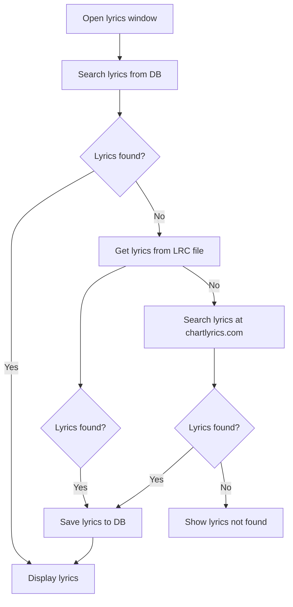
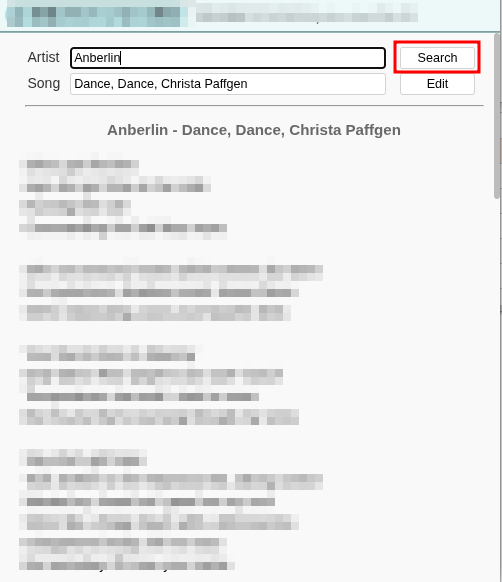
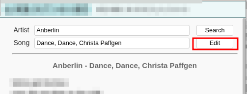
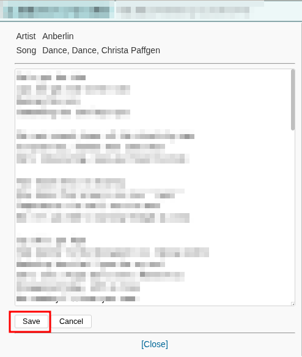

# Lyrics

Airsonic Advanced supports lyrics from the following sources.

1. Search from `chartlyrics.com` (Legacy Support)
2. LRC files
3. User Input

## Lyrics initial search

If you open the lyrics window, the following search process is initiated:


## Searching Lyrics via `chartlyrics.com`

Airsonic Advanced allows you to search for lyrics on `chartlyrics.com` using the song's title and artist name. This feature is mainly intended for legacy support, as the site may not always provide the most up-to-date lyrics.

When you open the lyrics window, you will see a page where you can enter the artist name and song title into the provided text fields.   
After clicking the search button, Airsonic Advanced will attempt to find the lyrics from `chartlyrics.com`. If lyrics are found, they will be displayed and automatically saved to the database.




## Searching Lyrics via LRC Files

Airsonic Advanced can display lyrics from LRC files.  
To use this feature, place an LRC file in the same directory as your music file, ensuring the filename matches exactly except for the extension. For example, `song.mp3` should have a corresponding `song.lrc` or `song.LRC`.

### Examples of Supported LRC Files

```
music/
├── artist/
│   ├── album/
│   │   ├── track.mp3
│   │   ├── track.lrc        ← Supported: filename matches, extension is .lrc
│   │   ├── track2.mp3
│   │   └── track2.LRC       ← Supported: filename matches, extension is .LRC
```

### Examples of Unsupported LRC Files

```
music/
├── artist/
│   ├── NotWorking/
│   │   ├── song.mp3
│   │   ├── song.Lrc         ← Not supported: mixed case extension
│   │   ├── song2.mp3
│   │   └── othername.lrc    ← Not supported: filename does not match
```

**Important Notes:**  
- The LRC file must be in the same folder as the music file.
- The filename must match exactly, except for the extension.
- Only `.lrc` (lowercase) and `.LRC` (uppercase) extensions are supported.
- Mixed case extensions (e.g., `.Lrc`) are not supported.
- LRC files with non-matching filenames will not be loaded.

### Supported LRC Formats

| Format                | Supported |
|-----------------------|-----------|
| Simple LRC            | Yes       |
| LRC with ID tags      | Yes       |
| Walaoke extension     | Yes       |
| A2 extension          | Yes       |

## User Input Lyrics

You can manually edit lyrics by clicking the "Edit" button in the lyrics window. This lets you change the displayed lyrics or add new ones. After making your changes, click "Save" to update the lyrics in the database.

To reset the lyrics to their original state, clear the lyrics in the editor and save.




